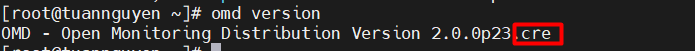
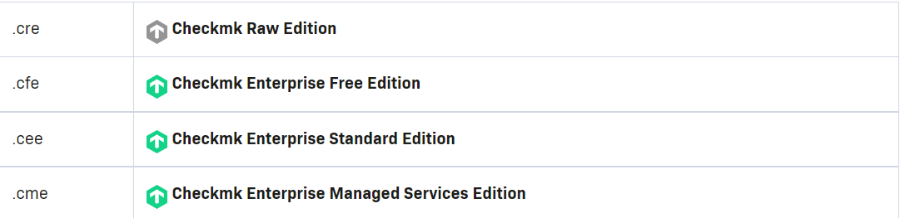
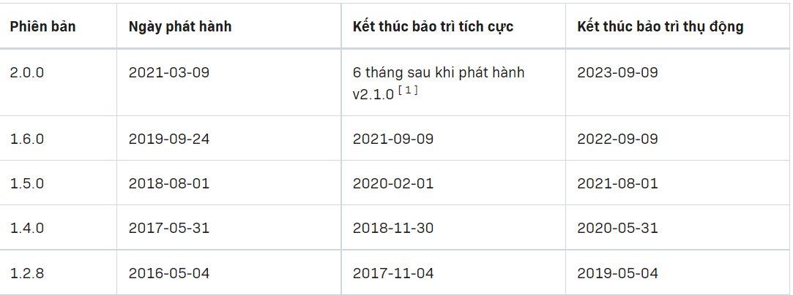
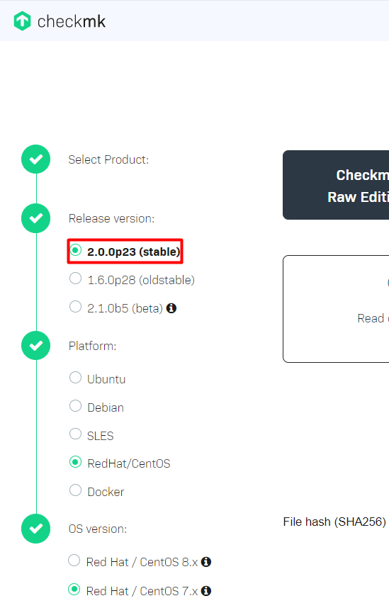
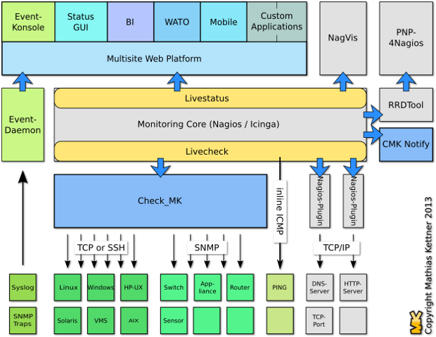

# Check_MK

- [Check_MK](#check_mk)
  - [1. Tổng quan về Check MK](#1-tổng-quan-về-check-mk)
    - [1.1 khái niệm](#11-khái-niệm)
    - [1.2 Các sản phẩm Check_MK](#12-các-sản-phẩm-check_mk)
    - [1.3 Các version Check_MK](#13-các-version-check_mk)
    - [1.4 Cấu trúc của Check_MK sử dụng lõi Nagios core](#14-cấu-trúc-của-check_mk-sử-dụng-lõi-nagios-core)
      - [1.4.1 LiveStatus](#141-livestatus)
      - [1.4.2 Monitoring Core(Check_MK,nagios,icinga)](#142-monitoring-corecheck_mknagiosicinga)
      - [1.4.3 LiveCheck](#143-livecheck)
      - [1.4.4 Multisite- Giao diện web](#144-multisite--giao-diện-web)
      - [1.4.4.1 Setup](#1441-setup)
      - [1.4.4.2 Event Console](#1442-event-console)
      - [1.4.5 Round Robin Database(RRD tool)](#145-round-robin-databaserrd-tool)
- [Tài liệu tham khảo](#tài-liệu-tham-khảo)


## 1. Tổng quan về Check MK 

### 1.1 khái niệm 

- Check MK là 1 giải pháp giám sát dựa trên mã nguồn mở.

- Checkmk là phần mềm được phát triển bằng Python và C ++ để giám sát Cơ sở hạ tầng CNTT .

-  Nó được sử dụng để giám sát máy chủ , ứng dụng , mạng, cơ sở hạ tầng đám mây (public, private, hybrid), containers, storage, databases and environment sensors.

### 1.2 Các sản phẩm Check_MK

- Check_MK hiện đang có 4 sản phẩm là :
  - Check_MK RAW Editon (CRE) 
  - Checkmk Enterprise Free Edition ( CFE )
  - check_MK enterprise Editon (CEE)
  - Checkmk managed Services Editon (CME)
  

|Tính năng|Check_MK_RAW(CRE)|Checkmk Enterprise Free Edition ( CFE )|Check_MK Enterprose Editon(CEE)|Check_MK Managed Services Edition(CME)|
|---|---|---|---|---|
|Có sẵn 1700 plugins|có|có|có|có|
|Event console vs syslog|có|có|có|có|
|dữ liệu sang đồ thị|có|có|có|có|
|báo cáo dạng PDF|có|có|có|có|
|Thời gian kiểm tra tiêu chuẩn|60s|1s|1s|1s|
|hệ thống giám sát phân tán|không|có|có|có|
|Tự động update agent|không|có|có|có|
|Giao diện GUI |có|có|có|có|
|Quản lý và chia dữ liệu chặt chẽ|không|không|không|có|


<h2>Kiểm tra sản phẩm hiện tại đang sử dụng</h2> :





<h2>Tổng quan các sản phẩm </h2>

- **Bản CRE** là bản mã nguồn mở và miễn phí và **kết hợp lõi Nagios**. 

- **Bản CFE** là phiên bản thử nghiệm Bản CEE 

  - ``Bản CFE`` chứa tất cả các tính năng của ```bản CEE``, miễn phí và không giới hạn trong 30 ngày đầu tiên. 
  - ``Bản CRE`` và ``Bản CFE``   đều có thể được nâng cấp trực tiếp lên ``bản CEE`` hoặc ``CME`` .

- **Bản CEE  và CME** là bản trả phí và sử dụng **Checkmk Micro Core** lõi có hiệu suất cao thay thế cho **Nagios core** và nhiều tính năng vượt trội khác.

- Chu kỳ phát triển của Check_mk là 6 tháng sẽ có 1 bản stable.

### 1.3 Các version Check_MK

Thời gian phát hành các phiên bản và các bản đã phát hành : 


Hiện tại thời điểm viết tài liệu bản **v2.1.0** đang ở chế độ beta :



### 1.4 Cấu trúc của Check_MK sử dụng lõi Nagios core



   *Cấu trúc Check_Mk sử dụng  ``Nagios core``*

- Check_Mk ra đời để giải quyết bài toán về hiệu năng mà Nagios gặp phải trong quá khứ. 

- Cơ chế mới của Check_MK cho phép việc mở rộng hệ thống trở nên dễ dàng hơn, có thể giám sát nhiều hệ thống chỉ từ một máy chủ Nagios server.

Tổng quan cách hoạt động :

- Các lõi sẽ gọi xuống **check_MK** để thực hiện chức năng kiểm tra của nó.

- Sau khi check thì **livestatus** sẽ hiển thị thông tin của check_mk lên website.

- **PNP4nagios**: được sử dụng để xử lý dữ liệu chuyển sang dạng biểu đồ.

- **Nagvis**: được sử dụng để vẽ lại mô hình giám sát giúp người dùng có thể nhìn một cách dễ dàng hiểu hơn.

- Dữ liệu sẽ được lưu vào trong **RRD tool**.

#### 1.4.1 LiveStatus

 - Livestatus cũng sử dụng nagios Event Broker API.
 
 - Livestatus tiêu tốn ít CPU.Livestatus sẽ sử dụng Socket để check dữ liệu do đó công việc được phân đều cho các CPU.
 - Khi truy xuất dữ liệu bằng Command line thì Livestatus có phân biệt chữ hoa và chữ thường.
 - Livestatus không cần cấu hình. Không cần cơ sở dữ liệu.Không cần quản lý.
 
#### 1.4.2 Monitoring Core(Check_MK,nagios,icinga)

#### 1.4.3 LiveCheck

- Trong Nagios 4.0 ngay cả một hệ thống hoàn hảo hiếm khi quản lý để thực hiện hơn một vài nghìn kiểm tra mỗi phút.

- Trong hệ thống lớn, tỷ lệ check tối đa sẽ trở lên rất tệ. Càng nhiều máy chủ và dịch vụ thì đồng nghĩa thời gian check sẽ phải tăng lên.

- Mỗi lần check tạo ra một bản Fork. Quá trình Fork rất tốn kém ngay cả khi tối ưu hóa

- Quá trình Fork trong Nagios Core không phân tán ra nhiều CPU mà thực hiện trên chỉ một CPU đơn. Điều này dẫn tới giới hạn số lần check mỗi giây, trong khi phần lớn các CPU khác rảnh rỗi

- Livecheck khắc phục nhược điểm:

- Livecheck sử dụng các Helper Process, Các core giao thiếp với helper thông qua Unix socket(Điều này không xảy ra trên file System).

- Chỉ có một Helper program được phân tán trên tất cả các Cpu thay vì chỉ một như trước.

- Process VM size tổng chỉ khoảng 100KB.

- Việc thực hiện Check_icmp sẽ chomotj con số cải tiến cụ thể. Giả sử nhếu sử dụng CPU Sual Core 2800MHz CPU: trước đây sẽ là 300 ICMP check/second, sau khi cải tiến 2600 ICMP check/second.

#### 1.4.4 Multisite- Giao diện web

- Để có thể thực hiện việc giám sát thì cần tạo ra một site để có thể sử dụng 
- Một server có thể tạo ra được nhiều site
- Để đăng nhập được vào site cần user. Có 3 loại user
  - Administrator
  - Guest
  - Normal monitoring
- Có 2 user mặc định có quyền Administrator là ``omdadmin`` và ``cmkadmin``

#### 1.4.4.1 Setup

#### 1.4.4.2 Event Console

- NGoài việc giám sát theo khoảng thời gian check bình thường còn có một loại giám sát theo sự kiện.

- Event console là hệ thống tích hợp theo dõi sự kiện từ các nguồn như syslog;SNMP traps; Windows event logs...

- Những sự kiện xảy ra không được xử lý bằng lõi của check_mk mà được xử lý bằng một dịch vụ riêng biệt.

#### 1.4.5 Round Robin Database(RRD tool)
 - Đây là dạng DB mặc định mà check_mk dùng để lưu trữ thông tin
 - Thông tin của DB được lưu trữ dưới dạng bảng và cột để lưu trữ dữ liệu
 - Có thể hợp nhất được dữ liệu của một khoảng thời gian lại vào làm một
 - Có thể truy vấn được dữ liệu trong RRD bằng live status language
 - Lưu ý ngôn ngữ truy vấn này phân biệt chữ hoa và chữ thường
 - Có thể sử dụng các ``header`` để lọc thông tin hiển thị từ các truy vấn được sử dụng.
 - Khi dữ liệu được lưu đầy thì nó sẽ ghi đè lên dữ liệu cũ.
 
 
# Tài liệu tham khảo 

   1. https://github.com/huydv398/Ghichep-CkeckMK
   2. https://github.com/niemdinhtrong/thuctapsinh/tree/master/NiemDT
   3. https://news.cloud365.vn/?s=checkmk
