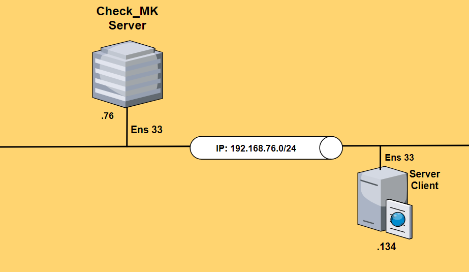
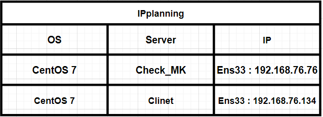
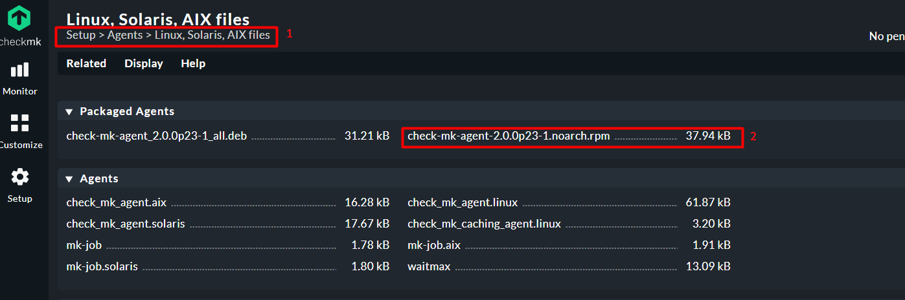
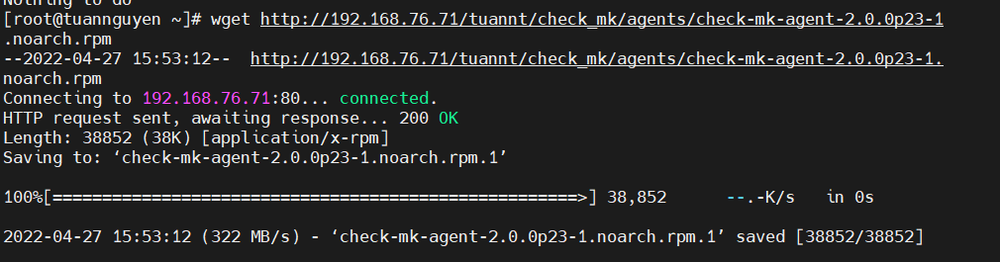
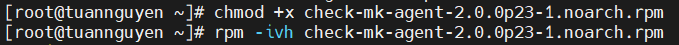
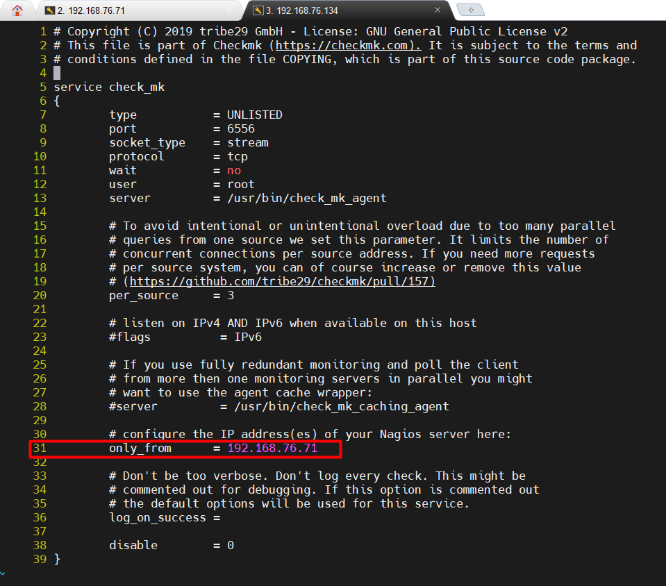

# Cài đặt agent của Check_MK trên CentOS-7

- [Cài đặt agent của Check_MK trên CentOS-7](#cài-đặt-agent-của-check_mk-trên-centos-7)
  - [**1. Mô hình mạng**](#1-mô-hình-mạng)
  - [**2. Các bước thực hiện**](#2-các-bước-thực-hiện)

## **1. Mô hình mạng** 


Mô hình mạng :




IPplanning:



## **2. Các bước thực hiện**

> **thực hiện trên máy Check_MK server :**


**<h2>Bước 1 : Tìm agent phù hợp cho máy Client</h2>**

Tại máy Check_MK server tìm agent phù hợp cho CentOS-7. Bản Agent phù hợp với CentOS-7 phải có đuôi file là `.rpm`

Lần lượt truy cập :




Copy tên file trong hình : 


Sao chép liên kết download, 

Ví dụ trong bài đang viết thì agent có Link như sau: 

Cú pháp ;

```
http://IPserverCMK/ten_site/check_mk/agents/....
```

ví dụ :

```
http://192.168.76.71/tuannt/check_mk/agents/check-mk-agent-2.0.0p27-1.noarch.rpm
```

**khi cài đặt chú ý phiên bản agent đang cài đặt ở đây là bản 2.0 p27**


> **Thực hiện trên máy clinet CentOS 7 :**

**<h2>Bước 2: Cài gói wget(nếu cài rồi bỏ qua bước này) :**</h2>


```
yum install -y wget
```


Note : wget là package dùng để tải package bằng link download về máy


**<h2>Bước 3 :Dùng gói wget download agent ở bước 1**</h2>

Ví dụ :
```
wget http://192.168.76.71/tuannt/check_mk/agents/check-mk-agent-2.0.0p27-1.noarch.rpm
```


**<h2>Bước 4 : Cấp quyền thực thi cho file vừa download**</h2>

```
chmod +x check-mk-agent-2.0.0p27-1.noarch.rpm
```


**<h2>Bước 5 : Cài đặt agent**</h2>

```
rpm -ivh check-mk-agent-2.0.0p27-1.noarch.rpm
```

or

```
dpkg -i check-mk-agent_2.0.0p27-1_all.deb
```

**<h2>Bước 6 : Cài đặt xinetd**</h2>

```
yum install xinetd -y
```

or

```
apt-get install xinetd
```


**<h2>Bước 7 : Khởi động xinetd**</h2>

```
systemctl start xinetd
systemctl enable xinetd
```

**<h2>Bước 8 : Cài đặt net-tools để kiểm tra các Port trên Client**</h2>

```
yum install -y net-tools
```

**<h2>Bước 9 : Mở port trên client để có thể giao tiếp với Check_MK server**</h2>

```
vi /etc/xinetd.d/check_mk
```

Mở file tìm đến các dòng và sửa các thông số sau :

Gõ `setnu` và trỏ đến các dòng 8,31,38

```
only_from      = 192.168.76.71
disable        = 0
port           = 6556
```

**192.168.76.1** : là địa chỉ máy server Check_MK



**<h2>Bước 10 : Kiểm tra port mặc định của Check_MK sử dụng để giám sát**</h2>

```
# netstat -npl | grep 6556
tcp6       0      0 :::6556                 :::*                    LISTEN      1/systemd`
```

**<h2>Bước 11 : Mở port trên firewall </h2>**

```
 firewall-cmd --add-port=6556/tcp --permanent
 firewall-cmd --reload
```
or
```
ufw allow 6556/tcp
ufw reload
```

**<h2>Bước 12 : Tắt SELinux**</h2>

```
setenforce 0
```


Thực hiện xong quá trình cài đặt agent của Check_MK trên CentOS-7. Bài tiếp theo tiến hành add host clinet vào Check_MK để thực hiện việc giám sát.

Link hướng dẫn add host để checkmk giám sát :

[Hướng dẫn add host để server check MK giám sát ](./add_host_CheckMk_C7.md)

