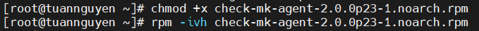

# Cài đặt agent của Check_MK trên CentOS-7

- [Cài đặt agent của Check_MK trên CentOS-7](#cài-đặt-agent-của-check_mk-trên-centos-7)
  - [**1. Mô hình mạng**](#1-mô-hình-mạng)
  - [**2. Các bước thực hiện**](#2-các-bước-thực-hiện)

## **1. Mô hình mạng** 


Mô hình mạng :


IPplanning:


## **2. Các bước thực hiện**

> **thực hiện trên máy Check_MK server :**


**<h2>Bước 1 : Tìm agent phù hợp cho máy Client</h2>**

Tại máy Check_MK server tìm agent phù hợp cho CentOS-7. Bản Agent phù hợp với CentOS-7 phải có đuôi file là `.pde`

Lần lượt truy cập theo bước 1 trong hình vẽ :


Copy tên file trong hình : 


Sao chép liên kết download, 

Ví dụ trong bài đang viết thì agent có Link như sau: 

```
http://192.168.76.72/tuanntu18/check_mk/agents/check_mk_agent.msi
```


 Ở đây cài đặt Agent trên clinet CentOS_7 nên sẽ chọn agent có đuôi là .msi

> **Thực hiện trên máy clinet Win 7:**


**<h2>Bước 2 :Truy cập vào trình duyệt web**</h2>

```
http://192.168.76.72/tuanntu18/check_mk/agents/check_mk_agent.msi
```


**<h2>Bước 4 : Cấp quyền thực thi cho file vừa download**</h2>

```
chmod +x check-mk-agent-2.0.0p23-1.noarch.rpm
```


**<h2>Bước 5 : Cài đặt agent**</h2>

```
rpm -ivh check-mk-agent-2.0.0p23-1.noarch.rpm
```

or

```
dpkg -i check-mk-agent-2.0.0p23-1.noarch.deb
```

**<h2>Bước 6 : Cài đặt xinetd**</h2>

```
yum install xinetd -y
```

or

```
apt-get install xinetd
```


**<h2>Bước 7 : Khởi động xinetd**</h2>

```
systemctl start xinetd
systemctl enable xinetd
```

**<h2>Bước 8 : Cài đặt net-tools để kiểm tra các Port trên Client**</h2>

```
yum install -y net-tools
```

**<h2>Bước 9 : Mở port trên client để có thể giao tiếp với Check_MK server**</h2>

```
vi /etc/xinetd.d/check_mk
```

Mở file tìm đến các dòng và sửa các thông số sau :

Gõ `setnu` và trỏ đến các dòng 8,31,38

```
only_from      = 192.168.76.71
disable        = 0
port           = 6556
```

**192.168.76.1** : là địa chỉ máy server Check_MK


**<h2>Bước 10 : Kiểm tra port mặc định của Check_MK sử dụng để giám sát**</h2>

```
# netstat -npl | grep 6556
tcp6       0      0 :::6556                 :::*                    LISTEN      1/systemd`
```

**<h2>Bước 11 : Mở port trên firewall </h2>**

```
 firewall-cmd --add-port=6556/tcp --permanent
 firewall-cmd --reload
```
or
```
ufw allow 6556/tcp
ufw reload
```

**<h2>Bước 12 : Tắt SELinux**</h2>

```
setenforce 0
```


Thực hiện xong quá trình cài đặt agent của Check_MK trên CentOS-7. Bài tiếp theo tiến hành add host clinet vào Check_MK để thực hiện việc giám sát.

Link hướng dẫn add host để checkmk giám sát :

https://github.com/tuannt76/Monitoring/blob/main/Check_MK/docs/H%C6%B0%E1%BB%9Bng_d%E1%BA%ABn_add_host_%C4%91%E1%BB%83_check_mk.md

