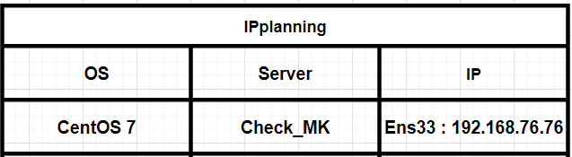

## 1.Mô hình triển khai

Dựng check_MK lên 1 OS Centos 7


IP Planning



## 2. Cài đặt Check_Mk server

**Lưu ý trước khi cài đặt :**

<h2>Update máy chủ trước khi cài đặt để tránh lỗi</h2>

```
yum update -y
reboot 
```


#### Bước 1 : Cài đặt ``wget``

```
yum install -y epel-release wget
```

#### Bước 2 : Download file cài đặt

Tải file cài đặt check_MK 2.0:

Cú pháp :

```
wget https://download.checkmk.com/checkmk/..../....
```
Link trang chủ CheckMK để kiểm tra phiên bản trước khi cài đặt:

```
https://checkmk.com/download
```

```
wget https://download.checkmk.com/checkmk/2.0.0p27/check-mk-raw-2.0.0p27-el7-38.x86_64.rpm
```

**khi cài đặt chú ý phiên bản agent đang cài đặt ở đây là bản 2.0 p27**

#### Bước 3 :Cài đặt CheckMK

```
yum install -y check-mk-raw-2.0.0p27-el7-38.x86_64.rpm
```
**khi cài đặt chú ý phiên bản agent đang cài đặt ở đây là bản 2.0 p27**

#### Bước 4 : Tạo một site 

`omd create  my_site `

**Ví dụ** :

``` 
omd create TuanNT
```

#### Bước 5 : Khởi động site

```
omd start TuanNT
```

#### Bước 6 : Đổi mật khẩu cho User **cmkadmin**

```
su - TuanNT
htpasswd -m etc/htpasswd cmkadmin
```

```
Nhập mật khẩu cho user
New password:
Re-type new password:
Updating password for user cmkadmin

```


Quay lại User **root** để thực hiện tiếp câu lệnh (`Ctrl` + `d`)

#### Bước 7 : Mở Port cho Http

```
firewall-cmd --permanent --add-port=80/tcp
firewall-cmd --reload
```

#### Bước 8 : Tắt SELinux

```
sed -i 's/SELINUX=enforcing/SELINUX=disabled/g' /etc/sysconfig/selinux
sed -i 's/SELINUX=enforcing/SELINUX=disabled/g' /etc/selinux/config
setenforce 0
```

Sau khi cài đặt truy cập vào trình duyệt : chorme, firefox,... 


#### Bước 9 : **Đăng nhập và truy cập vào bằng user như trên**  :

Ví dụ : 

```
http://192.168.76.76/TuanNT
```


**Giao diện check_Mk 2.0**


