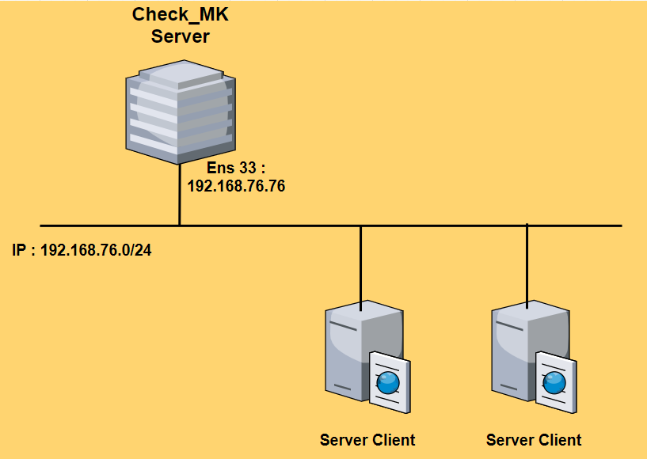

## 1.Mô hình triển khai

Dựng check_MK lên 1 OS Centos 7



IP Planning


## 2. Cài đặt Check_Mk server

#### Cài đặt ``wget``

`yum install -y epel-release wget`

#### Download file cài đặt

Tải file cài đặt check_MK 2.0:

```wget https://checkmk.com/support/2.0.0p23/check-mk-raw-2.0.0p23-el7-38.x86_64.rpm```

Cài đặt CheckMK

```yum install -y check-mk-raw-2.0.0p23-el7-38.x86_64.rpm```

Tạo một site 

`omd create  my_site `

Ví dụ :

``` omd create TuanNT```

Khởi động site

```omd start TuanNT```

Đổi mật khẩu cho User **cmkadmin**

```
su - TuanNT
htpasswd -m etc/htpasswd cmkadmin
```

`
#Nhập mật khẩu cho user
New password:
Re-type new password:
Updating password for user cmkadmin

`


Quay lại User **root** để thực hiện tiếp câu lệnh (`Ctrl` + `d`)

Mở Port cho Http

```
firewall-cmd --permanent --add-port=80/tcp
firewall-cmd --reload
```

Tắt SELinux

```
sed -i 's/SELINUX=enforcing/SELINUX=disabled/g' /etc/sysconfig/selinux
sed -i 's/SELINUX=enforcing/SELINUX=disabled/g' /etc/selinux/config
setenforce 0
```

Sau khi cài đặt truy cập vào trình duyệt : chorome, firefox,... 


