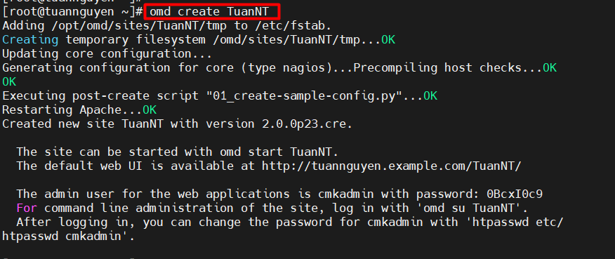
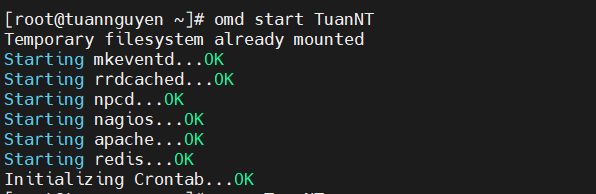
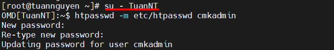
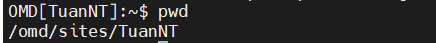
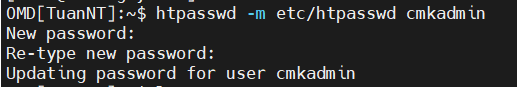
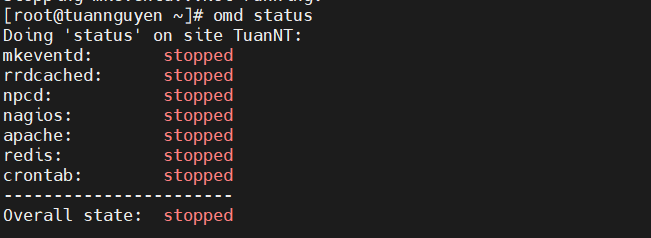
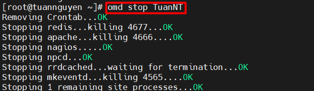
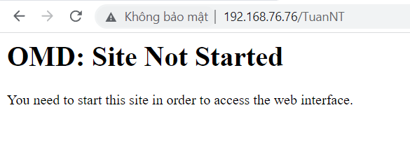

- [1.Thiết lập cơ bản Check_MK :](#1thiết-lập-cơ-bản-check_mk-)
  - [1.1 Lệnh cho người dùng ROOT server](#11-lệnh-cho-người-dùng-root-server)
  - [1.2 Các option uesr thực hiện trong Site :](#12-các-option-uesr-thực-hiện-trong-site-)
  - [1.3 Các option kiểm tra ``Stop`` và ``reload`` và ``status``...](#13-các-option-kiểm-tra-stop-và-reload-và-status)
  - [1.4 Các thông báo lỗi](#14-các-thông-báo-lỗi)

# 1.Thiết lập cơ bản Check_MK :

## 1.1 Lệnh cho người dùng ROOT server 

Lệnh :

```
Omd create mysite
```
ví dụ 

```
Omd Crate TuanNT
```


Sau khi tạo xong srart mysite :

``` 
Omd start mysite
```
Ví dụ :

```
Omd start TuanNT
```


## 1.2 Các option uesr thực hiện trong Site :

Sudo vào Site 

```
Su - Mysite
```
ví dụ 



lệnh ``pwd``



Đổi mật khẩu cho user " cmkamdin

```
htpasswd -m etc/htpasswd cmkadmin
```



Tạo 1 bản backup cho trang web TuanNT

```
omd backup /tmp/TuanNT.tgz
```


Lệnh thoát khỏi ``su``

```
Ctrl + D
```

## 1.3 Các option kiểm tra ``Stop`` và ``reload`` và ``status``... 

Kiểm tra trang thái của site TuanNT

```
Omd status
```


dừng site TuanNT

```
Omd stop
```



## 1.4 Các thông báo lỗi 


Không được bật lên thì sẽ hiện thỉ trang thái này :



nếu không có trang web :


